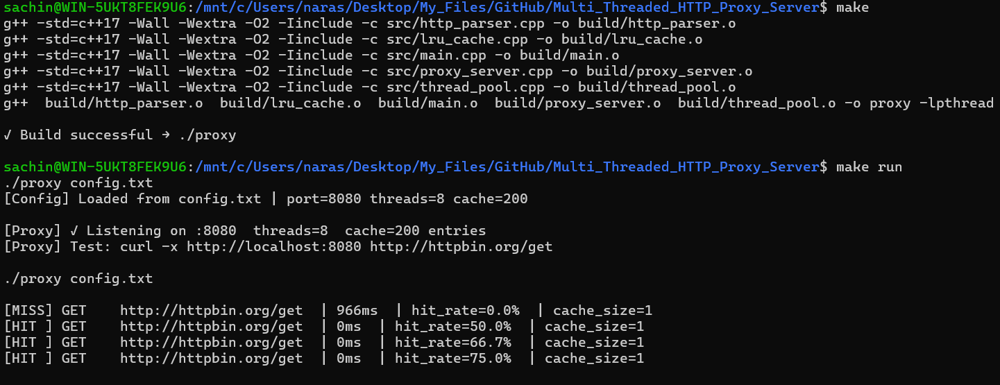
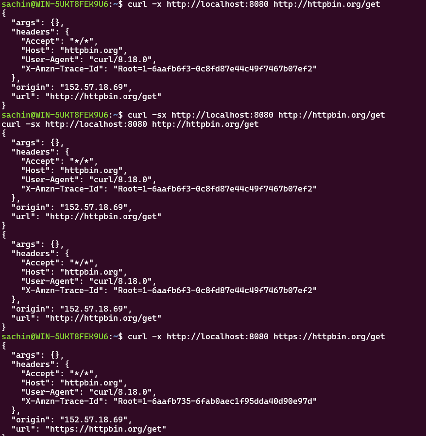
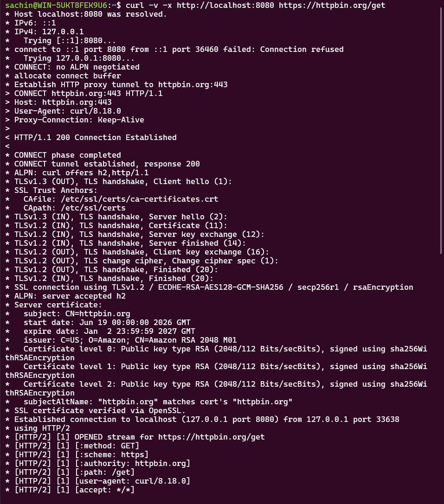
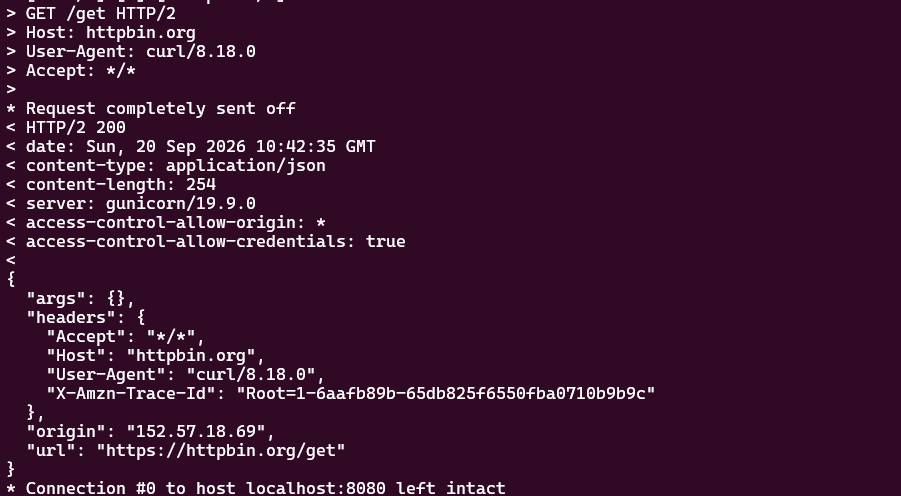

# HTTP Proxy Server

A multi-threaded HTTP/HTTPS proxy server written in C++-17.

## Architecture

```
Client
  │
  │  HTTP/HTTPS request
  ▼
┌────────────────────────────────────────────────────────┐
│  ProxyServer (main thread)                             │
│  socket() → bind() → listen() → accept() loop         │
│                │                                       │
│                │  push(client_fd)                      │
│                ▼                                       │
│  ┌─────────────────────────────────┐                  │
│  │  ThreadPool  (N worker threads) │                  │
│  │  queue<task> + mutex + cond_var │                  │
│  └────────────────┬────────────────┘                  │
│                   │  handle_client(fd)                 │
│                   ▼                                    │
│  ┌────────────────────────────────────────────────┐   │
│  │  Per-connection logic (worker thread)          │   │
│  │                                                │   │
│  │  recv() raw bytes                              │   │
│  │       │                                        │   │
│  │  HttpParser::parse()  ──► HttpRequest struct   │   │
│  │       │                                        │   │
│  │  is_connect? ──yes──► tunnel_connect()         │   │
│  │       │                   (select() relay)     │   │
│  │       no                                       │   │
│  │       ▼                                        │   │
│  │  GET? → LRUCache::get(url)                     │   │
│  │           HIT  ──► return cached response      │   │
│  │           MISS ──► forward_request()           │   │
│  │                        │                       │   │
│  │                    getaddrinfo() + connect()   │   │
│  │                    send() + recv() loop        │   │
│  │                        │                       │   │
│  │                    LRUCache::put(url, resp)    │   │
│  │                        │                       │   │
│  │  send() response to client                     │   │
│  │  log: [HIT/MISS] METHOD URL | Xms | hit_rate   │   │
│  └────────────────────────────────────────────────┘   │
└────────────────────────────────────────────────────────┘
```

## Build

```bash
# Prerequisites: g++17, make, pthreads (Linux/macOS)
make          # builds ./proxy
make run      # build + start on port 8080
make clean    # remove build artifacts
```

## Usage

```bash
# Start the proxy
./proxy config.txt

# In another terminal — HTTP
curl -x http://localhost:8080 http://httpbin.org/get

# HTTPS tunnel
curl -x http://localhost:8080 https://httpbin.org/get

# Concurrent load test (watch HIT rate climb after first batch)
for i in $(seq 1 20); do
  curl -sx http://localhost:8080 http://httpbin.org/ip &
done
wait

# Custom port/threads
PORT=9090 THREADS=16 CACHE_SIZE=500 ./proxy
```

## Demo

The following three-terminal workflow demonstrates HTTP forwarding, real-time
LRU cache updates, and HTTPS tunneling.

### Terminal 1: Build and start the proxy

Run `make` to compile the proxy, then run `make run` to start the server using
`config.txt`. Keep this terminal open to watch each request and the cache
status live:

```bash
make
make run
```

The proxy prints `[MISS]` when it forwards a GET request to the origin server
and stores the response. A later request for the same URL prints `[HIT ]` and
is served from the LRU cache. The log also reports the current `hit_rate` and
`cache_size`.



### Terminal 2: Send an HTTP GET request

With the proxy running on port `8080`, send a GET request through it. Repeat
the request to see the first request produce a cache MISS and subsequent
requests produce cache HITs in Terminal 1:

```bash
curl -x http://localhost:8080 http://httpbin.org/get
curl -sx http://localhost:8080 http://httpbin.org/get
```



### Terminal 3: Test HTTPS tunneling

Use `curl -v` to display the proxy's `CONNECT` request, the
`200 Connection Established` response, and the TLS exchange. The output is
shown across the two screenshots below:

```bash
curl -v -x http://localhost:8080 https://httpbin.org/get
```





## Configuration (`config.txt`)

| Key          | Default | Description                          |
|--------------|---------|--------------------------------------|
| `PORT`       | 8080    | Listening port                       |
| `THREADS`    | 8       | Thread pool size                     |
| `CACHE_SIZE` | 200     | Max cached GET responses (LRU evict) |
| `TIMEOUT`    | 10      | Socket recv/send timeout (seconds)   |

## Features

- **Multi-threaded**: Fixed thread pool (N workers) handles concurrent clients
- **LRU Cache**: O(1) get/put via `unordered_map` + doubly-linked `std::list`
- **HTTP Proxy**: Parses requests, rewrites absolute→relative URLs, forwards to origin
- **HTTPS Tunnel**: `CONNECT` method + bidirectional `select()` relay
- **Graceful shutdown**: `SIGINT`/`SIGTERM` → `stop()` closes server socket
- **Configurable**: `config.txt` key=value pairs; all have sane defaults

